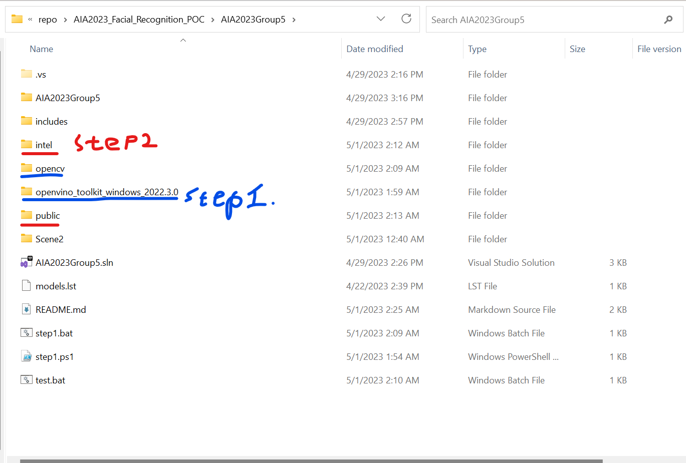
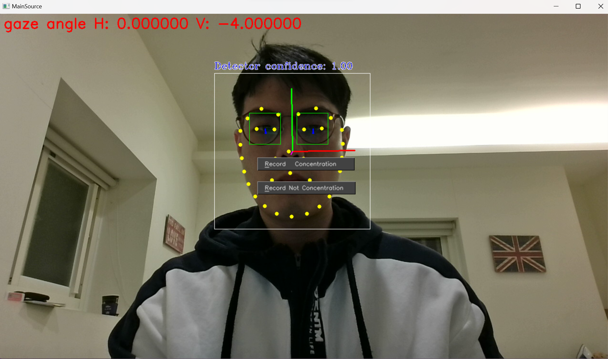

# 設定開發環境

Step 1: 
* 下載 openvino toolkit 與 runtime 2022.3.0 並解壓縮至 專案目錄的 openvino_toolkit_windows_2022.3.0 資料夾中
* 下載 openCV4.7.0 並解壓縮至 專案目錄的 opencv 資料夾中
* 這段過程會比較花費時間，因為會下載openvino 與 openCV

可直接執行 step1.bat 或根據需求執行以下指令:
```
wget -Uri https://storage.openvinotoolkit.org/repositories/openvino/packages/2022.3/windows/w_openvino_toolkit_windows_2022.3.0.9052.9752fafe8eb_x86_64.zip -OutFile openvino_toolkit_windows_2022.3.0.zip
mkdir openvino_toolkit_windows_2022.3.0 
tar -xf openvino_toolkit_windows_2022.3.0.zip -C openvino_toolkit_windows_2022.3.0 --strip-components 1

wget -Uri https://github.com/opencv/opencv/releases/download/4.7.0/opencv-4.7.0-windows.exe -OutFile opencv-4.7.0-windows.exe
.\opencv-4.7.0-windows.exe
```

Step 2:
* 請先安裝好Python 3.6以上
* 安裝openvino 開發工具套件 openvino-dev 
* 使用omz_downloader 根據 models.lst 下載需要的預訓練模型
* 使用omz_converter 根據 models.lst 對模型進行轉檔

可直接執行 step2.bat 或根據需求執行以下指令:
```
pip install openvino-dev
pip install --upgrade pip
pip install
omz_downloader --list models.lst
omz_converter --list models.lst
```

以上環境設定完畢專案資料夾結構如下圖:



使用 Visual Studio 2022 開啟 AIA2023Group5.sln 並執行 Scene2 專案 應可看見視線偵測的範例


# 錄製資料集說明

發布於 20230501 GazeRecord.zip中

執行 GazeRecord\Release\Scene2.exe 


* Record Concentration :開始錄製專注上課特徵資料，左上方會有錄製提示，再按一次停止。 


* Record Not Concentration :開始錄製非專注上課特徵資料，左上方會有錄製提示，再按一次停止。 

* 錄製檔案csv 儲存於 GazeRecord\Release 下 檔案名稱為開始錄製時間。 
