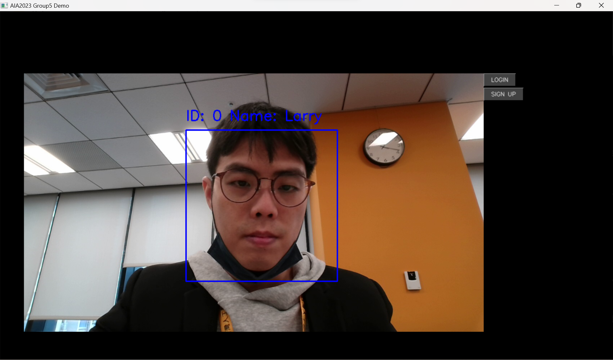
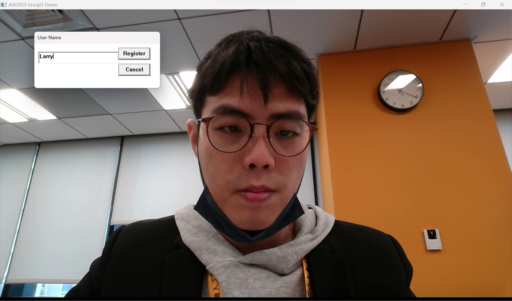
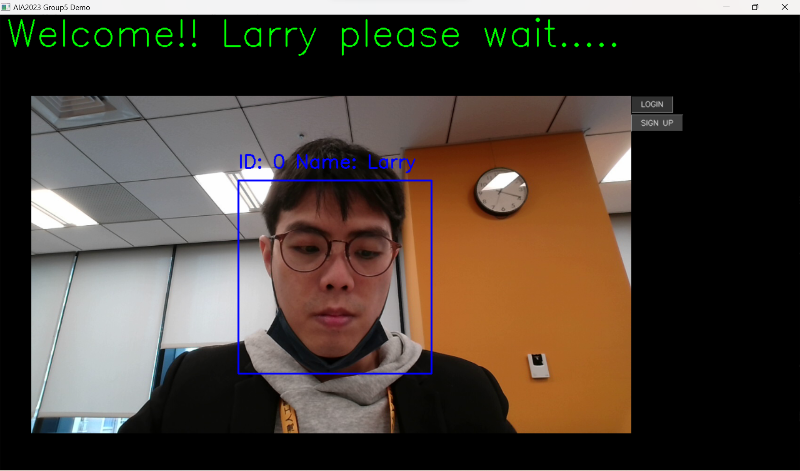
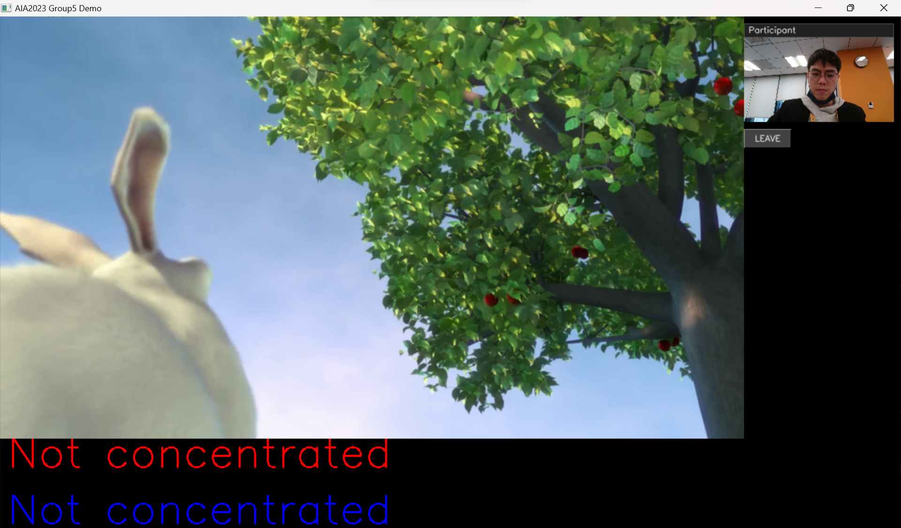

# AIA2023Group5_Facial_Engagement_Detection

資料夾架構如下:  

```
├───faceDB --> 人臉資料庫
├───models --> 模型檔案
└───Release
    └───AIA2023Group5.exe --> demo 執行檔案
```

# 環境要求:
* Intel GPU
* Windows 11
* 要有網際網路能力

# 使用說明:
1. 執行 Release\AIA2023Group5.exe 進入 Scene1.
  

2. 使用SIGN UP 按鈕照相註冊 (已註冊過跳過此步驟).
  

3. 臉部盡可能對正， 畫面出現身分標籤後按下 LOGIN 按鈕進入 Scene2.
  
4. Scene2 左半邊會顯示網路的sample影片， 右上方會有電腦的相機畫面。

5. 下方會有不專心的提示。 (紅色為使用模型預測結果，藍色為數學演算法計算閥值)
6. LEAVE 按鈕回到 Scene1
7. 'X' 離開程式

